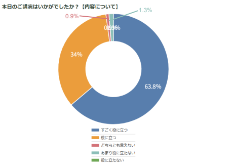

# セミナーのタイトル
1.医療者のための生成AIセミナー　初級編
日時：2025年12月27日　19:00-22:00
オンライン開催
登録URL：https://fincs.jp/plan/3052311990205796913/join/agreement?planPriceId=1008
参加費用:3000円+手数料

2.医療者のための生成AIセミナー　中級編
日時：2025年12月28日 13:00-16:00
オンライン開催
登録URL：https://fincs.jp/plan/3052311990205796913/join/agreement?planPriceId=1009
参加費用:3000円+手数料

# セミナー概要
ChatGPTは便利そうだけど、画像生成くらいしか使ったことない。。。上司はつかってないし、普段の診療が忙しいし勉強は後回し・・・。と思っている医療者の皆さんに送る医療者向け生成AIのハンズオンセミナー。講師は10年以上医療AIの開発・医療応用について開発してきた、だれよりもAIについて詳しい三澤将史医師です。
今回は2025年夏にe-casebookで開催したセミナー内容をほぼ一新し、生成AIのトレンドを把握し、さらに一歩踏み込んだ活用術について解説します。初級編と中級編の２回に分けて生成AIの基礎から応用までをじっくりハンズオン形式で行いますので、生成AIの経験がない方でも安心してご参加いただけます。
ここでしか聞けない内容を盛りだくさんですので、最近講師のAIセミナーを聞いた方もぜひ申し込んでください。
参加者の皆さんにはオンデマンド動画、講師謹製のChrome拡張、セミナーで使用したプロンプト集へのリンクをプレゼントします。
AI活用術を学び2026年を飛躍の年にしよう！

# セミナーコンテンツ
1.医療者のための生成AIセミナー　初級編
- ChatGPT 、Gemini、Claude紹介
- ユーザータイプ別、課金するならこれ！
- 初期設定
- 基本操作からプロンプトおさらい
- スライドに役立つ画像生成のこつ
- PudMed MCPの設定
- MCPを使った文献検索
- Chrome拡張の自作のススメ

2.医療者のための生成AIセミナー　中級編
- Notebook LM活用術
- Obsidian + Zoteroによる文献管理
- Antigravity を使ったvibe writingによるcase report執筆
- 簡易システマティックレビュー
- 論文執筆術

# 著者実績

- 日本初の医療機器AIであるEndoBRAINの開発メンバー
- 生成AIに関する情報発信を行い、総フォロワー数2万人超
- e-casebookで開催したセミナーでは述べ7000人以上が視聴登録 満足度97.8%

- 英文論文 150報以上, h-index 38